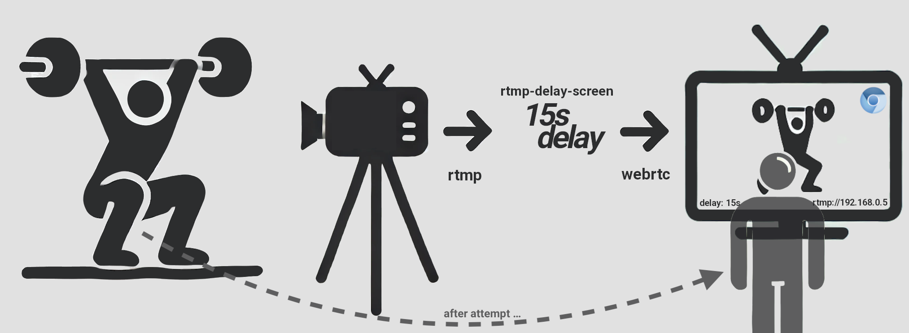

# RTMP Delay Screen

## idea

olympic weightlifters need to constantly review and analyse their lifting attempts while training. but a live stream to the gym'server
TV isnt helpful, cause while performing they need to focus on the execution of the lift. so `rtmp-delay-screen` records the stream
and replays it on a certain, configurable, delay.



## how it works

`rtmp-delay-screen` ...

- can be installed on a **raspberry-pi**, which is connected (via HDMI) to a TV or any other screen.
- acts like an RMTP-Server that you can use as a server in your favourite video-streaming-client-app, like `IPCam Lite`.
- records and stores the stream via an in-memory **ring-buffer**
- boots up a **chromium** instance in fullscreen **kiosk mode** to act, via an html5-video-tag, as a player. this makes it way easier to "inject" infos to the video-feed via javascript, and so avoids re-rendering.
- the stream is re-streamed to the chromium-instance via **webRTC**
- starts an admin-interface to adjust the delay and other parameters

## start browser

open chrome-browser with

```
--autoplay-policy=no-user-gesture-required
```

otherwise `autoplay` of the video wont work

## setup raspberry-pi

```
make setup
```

## build and deploy server-app

```
go mod tidy
make build
make deploy
```

## develop

run build in watchmode

```
make run-web-gen
make run
```
